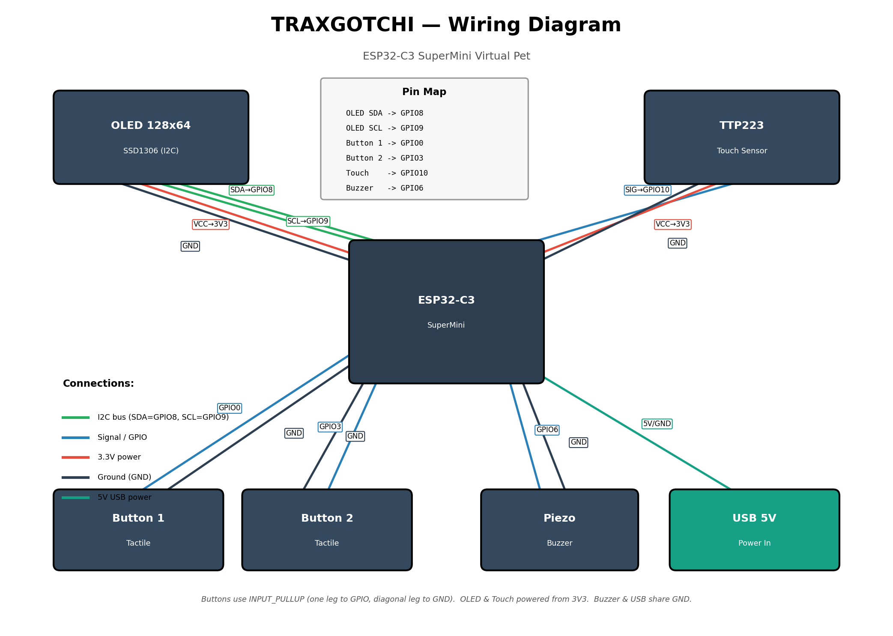

# Tomogatchi

A handheld, USB-powered virtual pet built on an ESP32-C3 SuperMini with a 128×64 OLED display, inspired by the early-2000s Tamagotchi toys. Choose from three pixel-art pets — Mochi, Pip, and Bean — feed them, clean up after them, and play mini-games to keep their stats high. Neglect them and they'll get sick and eventually die. The pet evolves through three visual growth stages, reacts with animated moods, and plays chiptune sound effects through a tiny piezo buzzer, all running on a chip smaller than a postage stamp.

---

## Features

- **3 selectable pixel-art pets** — Mochi (round kitten), Pip (big-eared fox-cat), Bean (sleepy chubby cat)
- **Evolution stages** — pets visually mature as happiness and age accumulate
- **Mood system** — idle, happy, sad, sick, and sleeping animations driven by live stats
- **3 mini-games** — keep your pet entertained and boost its stats
- **Stats screen** — flip through hunger, happiness, hygiene, energy, and age
- **Pet chooser** — browse and equip any of the three pets mid-session
- **Particle system** — visual feedback bursts for feeding, playing, and cleaning actions
- **Sound queue engine** — non-blocking chiptune melodies and effects via piezo buzzer
- **Persistent state** — pet data survives reboots (stored in NVS)

---

## Hardware / Bill of Materials

| Component | Description | Qty |
|---|---|---|
| ESP32-C3 SuperMini | Main MCU — Wi-Fi/BLE, USB-C, 3.3 V logic | 1 |
| SSD1306 OLED 128×64 | I²C monochrome display, 0.96" | 1 |
| Tactile push button | 6×6 mm PCB button | 2 |
| TTP223 touch sensor | Capacitive touch breakout, 3.3 V | 1 |
| Piezo buzzer | Passive 5 V buzzer (works fine at 3.3 V) | 1 |
| USB-C cable | Power from any USB port or bank | 1 |
| Enclosure | 3D-printed (Fusion 360 source in `/cad`) | 1 |

---

## Wiring



### Pin Map

| Signal | ESP32-C3 Pin | Notes |
|---|---|---|
| OLED SDA | GPIO 8 | I²C data |
| OLED SCL | GPIO 9 | I²C clock |
| Button 1 | GPIO 0 | INPUT\_PULLUP — one leg to GPIO, diagonal leg to GND |
| Button 2 | GPIO 3 | INPUT\_PULLUP — one leg to GPIO, diagonal leg to GND |
| Touch sensor OUT | GPIO 10 | TTP223 powered from 3V3 |
| Piezo buzzer + | GPIO 6 | Buzzer – and USB GND share common ground |

**Power**: OLED VCC and TTP223 VCC both connect to the ESP32-C3 SuperMini's **3V3** pin. The board is powered via its onboard USB-C port.

---

## Build Instructions

### 1. Arduino IDE Setup

1. Open Arduino IDE (2.x recommended).
2. Go to **File → Preferences** and add the ESP32 board manager URL:
   ```
   https://raw.githubusercontent.com/espressif/arduino-esp32/gh-pages/package_esp32_index.json
   ```
3. Go to **Tools → Board → Boards Manager**, search for `esp32`, and install the **Espressif Systems** package.
4. Select **Tools → Board → ESP32 Arduino → ESP32C3 Dev Module**.
5. Set **Tools → Partition Scheme → Huge APP (3MB No OTA/1MB SPIFFS)** (or any scheme with ≥ 2 MB app partition).
6. Set **Tools → USB CDC On Boot → Enabled** (required for serial monitor on ESP32-C3 SuperMini).

### 2. Install Libraries

In **Tools → Manage Libraries**, install:

- `Adafruit SSD1306` (by Adafruit)
- `Adafruit GFX Library` (by Adafruit)
- `Wire` — bundled with the ESP32 core, no install needed

### 3. Flash

1. Open `firmware/tomogatchi/tomogatchi.ino` in Arduino IDE.
2. Plug the ESP32-C3 SuperMini in via USB-C.
3. Select the correct port under **Tools → Port**.
4. Click **Upload** (→).

> If the board isn't detected, hold the **BOOT** button while plugging in to enter download mode.

---

## Controls

### HOME screen
| Input | Action |
|---|---|
| Both buttons | Open Menu |
| Button 1 (GPIO 0) | View Stats |
| Button 2 (GPIO 3) | Open Pet Chooser |
| Touch sensor | Interact with pet (feed / pet) |

### MENU screen
| Input | Action |
|---|---|
| Button 1 | Navigate Left |
| Button 2 | Navigate Right |
| Touch sensor | Select item |
| Both buttons | Exit Menu |

### PET CHOOSER screen
| Input | Action |
|---|---|
| Button 1 | Previous pet |
| Button 2 | Next pet |
| Touch sensor | Equip selected pet |
| Both buttons | Exit Chooser |

---

## How It Works

### State Machine

The firmware is organized as a flat state machine with the following top-level states:

```
HOME → MENU → FEED / CLEAN / PLAY / STATS / CHOOSER
```

Each state owns its draw loop and input handler. Transitions are driven by button combos and touch events detected in the main `loop()`.

### Sprite System

All pet art is stored as PROGMEM `uint8_t` bitmap arrays. The sprite renderer calls `oled.drawBitmap()` and swaps frames on a timer to produce walking/idle animations. Each pet has frames for: idle, walk, happy, sad, sick, eat, and sleep poses across each evolution stage.

### Particle System

A small fixed-size array of `Particle` structs drives visual feedback (hearts, stars, bubbles). Each particle has a position, velocity, lifetime, and glyph. The renderer updates and draws all live particles every frame.

### Sound Queue Engine

Sound effects and melodies are defined as `Note[]` arrays in PROGMEM. A lightweight non-blocking queue holds the current melody pointer and note index; `updateSound()` is called every loop iteration and issues `tone()` / `noTone()` calls based on elapsed time. This keeps audio playback from stalling the display.

---

## Repository Structure

```
/firmware/tomogatchi/   Arduino sketch
/cad/                   Fusion 360 source (.f3d) for the enclosure
/docs/                  Wiring diagram and supplementary documentation
/images/                Build photos and renders
README.md
LICENSE
```

---

## License

MIT — see [LICENSE](LICENSE).
